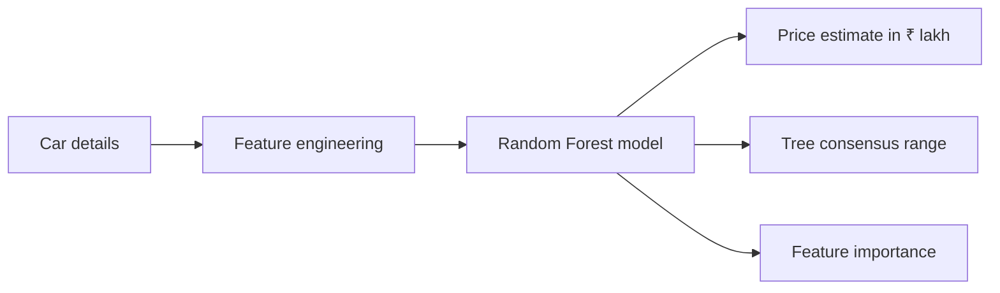

# CarValue AI

> A polished, end-to-end machine learning project that predicts used-car selling prices in Indian lakh units — from feature engineering and hyperparameter search to a live Streamlit experience.

[](https://www.python.org/)
[](https://streamlit.io/)
[](https://scikit-learn.org/)

## What it does

CarValue AI estimates a used car's resale price from:

- showroom price;
- kilometres driven;
- manufacture year, transformed into vehicle age;
- previous owners;
- fuel type;
- seller type; and
- transmission type.

The app turns the original notebook workflow into a deployable product: users enter a car profile, receive a live estimate, see a descriptive Random Forest consensus range, inspect holdout metrics, and explore the source data.

## Product preview



## Model approach

1. Load the 301-row `car.csv` dataset.
2. Derive `Years_Since_Manufacture = 2024 - Year`.
3. Remove the high-cardinality `Car_Name` field.
4. One-hot encode fuel, seller, and transmission categories.
5. Split the data into 80% training and 20% holdout sets with `random_state=42`.
6. Tune a `RandomForestRegressor` with `RandomizedSearchCV` and 5-fold cross-validation.
7. Export the best estimator to `random_forest_regression_model.pkl`.

The reference year is deliberately fixed at 2024 because it is part of the feature contract used to train the supplied model artifact. The app exposes this assumption in the UI rather than silently changing the meaning of vehicle age.

### Holdout baseline

The checked-in model was evaluated on the reproducible 61-row holdout split:

| Metric | Result | Interpretation |
| --- | ---: | --- |
| R² | **0.93** | Variance explained by the model |
| RMSE | **₹1.30 lakh** | Penalizes larger errors more strongly |
| MAE | **₹0.72 lakh** | Average absolute error |

These are benchmark metrics, not a guarantee for any individual car. Real-world prices also depend on location, condition, service history, accident history, demand, and negotiation.

## Run locally

### 1. Clone and enter the project

```bash
git clone https://github.com/<your-username>/car-price-prediction.git
cd car-price-prediction
```

### 2. Create an environment and install dependencies

Windows PowerShell:

```powershell
py -3.13 -m venv .venv
.\.venv\Scripts\Activate.ps1
python -m pip install --upgrade pip
pip install -r requirements.txt
```

macOS / Linux:

```bash
python3 -m venv .venv
source .venv/bin/activate
python -m pip install --upgrade pip
pip install -r requirements.txt
```

### 3. Launch the Streamlit app

```bash
streamlit run app.py
```

Open the local URL printed by Streamlit, usually `http://localhost:8501`.

## Re-train the model

The checked-in `.pkl` file makes the app immediately runnable. To reproduce the training workflow after changing the dataset:

```bash
python train_model.py
```

To search more configurations:

```bash
python train_model.py --n-iter 20 --reference-year 2024
```

The training script keeps feature order, preprocessing, and the reference year aligned with the app. The original `model_training.ipynb` is also included for notebook-based exploration.

## Deploy on Streamlit Community Cloud

1. Create a public GitHub repository and push this project.
2. Visit [share.streamlit.io](https://share.streamlit.io/) and sign in with GitHub.
3. Select **New app**.
4. Choose your repository, branch, and `app.py` as the main file.
5. Deploy.

Streamlit Cloud will install `requirements.txt`. Keep `car.csv` and `random_forest_regression_model.pkl` in the repository root because the app loads them relative to `app.py`.

## Project structure

```text
car_price_prediction/
├── app.py                              # Streamlit entry point
├── train_model.py                      # Reproducible RandomizedSearchCV training
├── model_training.ipynb                # Notebook version of the workflow
├── car.csv                             # Training dataset
├── random_forest_regression_model.pkl  # Serialized best model
├── requirements.txt                    # Runtime dependencies
├── .streamlit/config.toml              # App theme and server defaults
└── README.md                           # Project documentation
```

## Engineering notes

- `st.cache_resource` prevents the model from being reloaded on every interaction.
- `st.cache_data` keeps dataset and evaluation work lightweight across reruns.
- `st.form` batches the seven inputs so predictions happen only on submit.
- The inference row is explicitly reindexed to the model's stored feature names, reducing the risk of one-hot encoding order bugs.
- The consensus range is the 10th–90th percentile of individual tree outputs; it is a model-spread signal, not a calibrated confidence interval.

## Limitations and next improvements

The dataset is small and reflects a particular used-car market snapshot. A production-grade version could add location, body style, service records, accident history, mileage normalization, drift monitoring, calibrated prediction intervals, and a larger time-aware training set.

## License

This project is provided for educational and portfolio use. Add a license file before distributing it as an open-source project.

